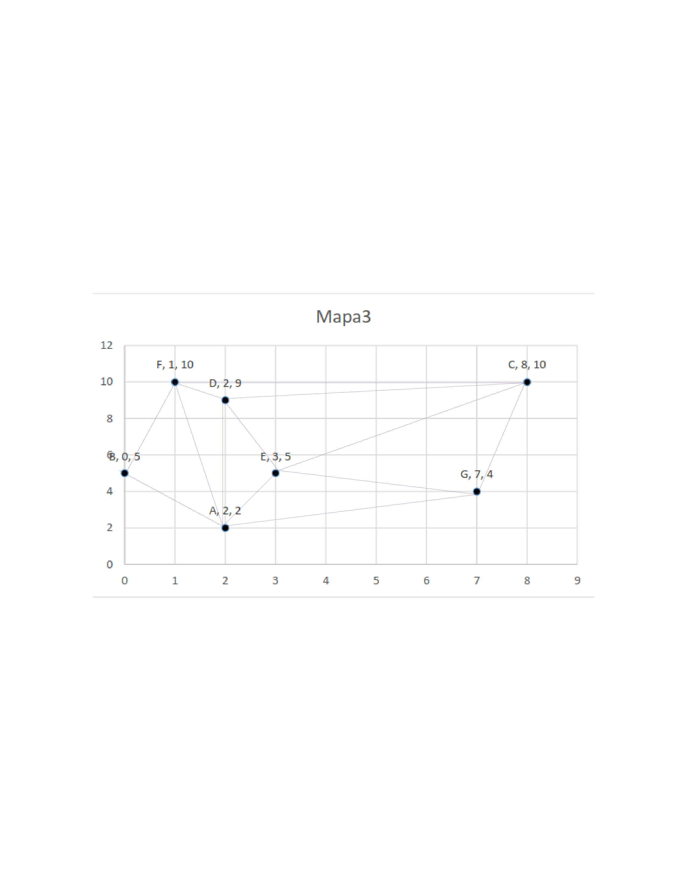

# KNN
Program for finding the shortest path in a graph using Nearest Neighbor Algorithm.


## Run Locally

Clone the project

```bash
  git clone https://github.com/errsync/KNN.git
```

Go to the project directory

```bash
  cd dijkstry
```
Run
```bash
  go run main.go
```

## Screenshots



